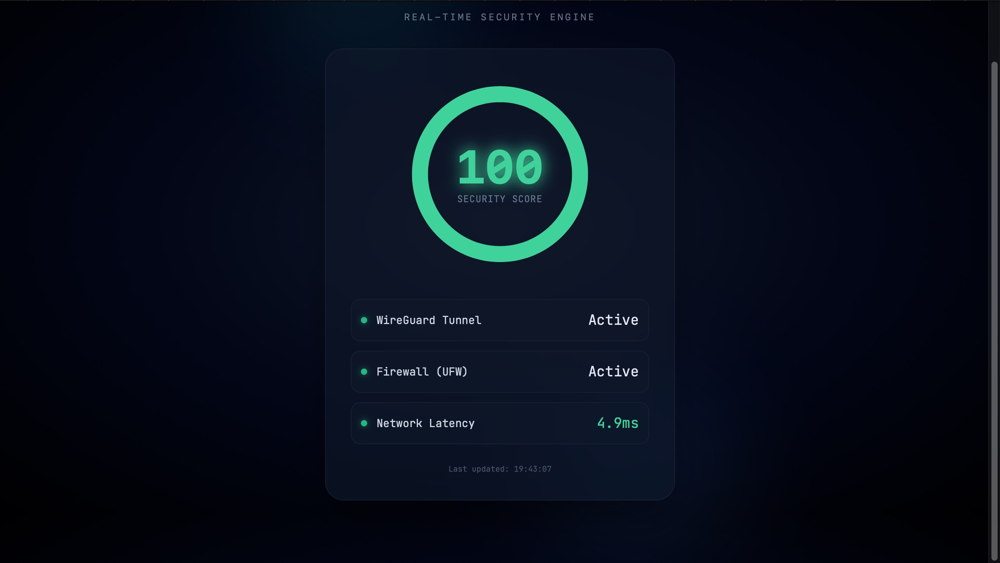

# XO-Shield // OrbitGuard

> **A Real-time WireGuard VPN Security Engine & Dashboard**
> *Live Demo: https://vpn.xoxoent.space*

## 🛡️ Overview
**XO-Shield** is a self-hosted VPN infrastructure and security monitoring system designed to solve the "black box" problem of standard VPNs. Instead of just connecting blindly, XO-Shield provides a **real-time "Security Score"** (0-100) based on live telemetry from the server's kernel.

It runs on a **Ubuntu 22.04 VPS** and uses a custom Python engine to audit the connection status, firewall integrity, and network latency every 10 seconds.

## ⚡ Key Features
* **Real-time Security Scoring:** A custom algorithm calculates a trust score (0-100) based on critical security vectors.
* **Visual Telemetry:** A "Deep Space" aesthetic dashboard powered by **FastAPI** and **Tailwind CSS**.
* **Non-Blocking Architecture:** Uses Python `threading` to perform heavy network probes (Ping, WireGuard Handshakes) in the background without slowing down the API.
* **Secure Networking:** Implements **WireGuard** with Kernel-level NAT masquerading (IP Forwarding).
* **Production Hardening:**
    * Deployed behind an **Nginx Reverse Proxy** with SSL (Let's Encrypt).
    * Protected by a whitelist-only **UFW Firewall**.
    * Systemd automated service management.

## Tech Stack

*   **Backend**: Python 3.10+, FastAPI
*   **System Monitoring**: `psutil`, `ip`, `ufw`
*   **Frontend**: HTML5, Vanilla JavaScript, Tailwind CSS (CDN)
*   **Server**: Nginx (Reverse Proxy), Uvicorn (ASGI)
*   **VPN**: WireGuard
